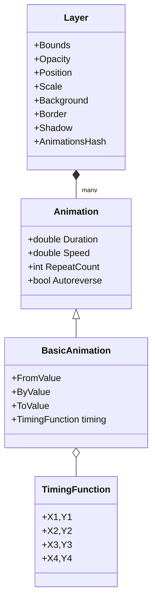

```mermaid
classDiagram
    Animation <|-- BasicAnimation
    BasicAnimation o-- TimingFunction
    Layer *-- "many" Animation

    class Layer{ 
      +Bounds
      +Opacity
      +Position
      +Scale
      +Background
      +Border
      +Shadow
      +AnimationsHash
    }
    class Animation{ 
      +double Duration
      +double Speed
      +int RepeatCount
      +bool Autoreverse
    }

    class BasicAnimation{ 
      +FromValue
      +ByValue
      +ToValue
      +TimingFunction timing
    }


    class TimingFunction{
      +X1,Y1
      +X2,Y2
      +X3,Y3
      +X4,Y4
    }
```