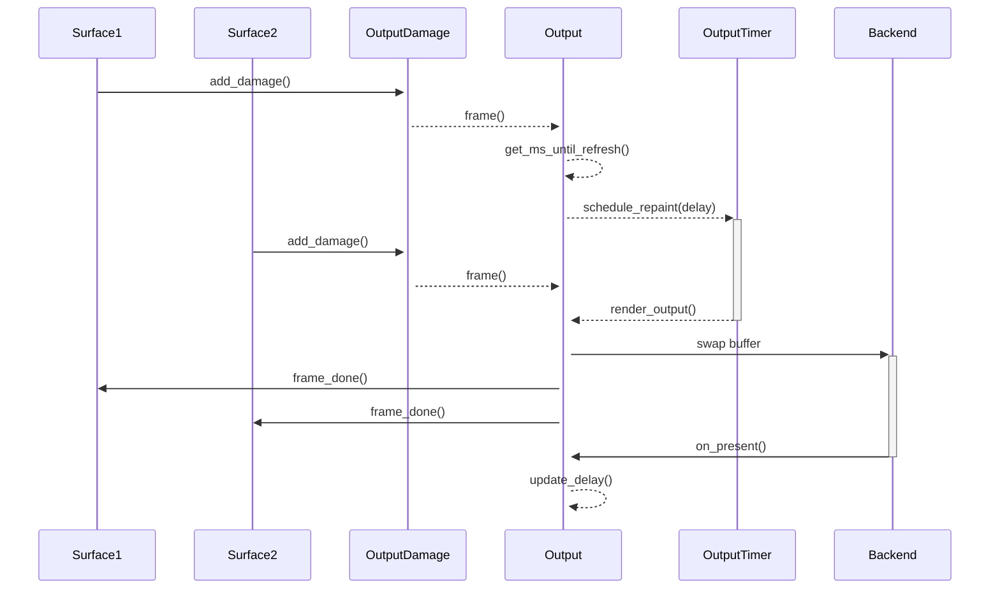

```mermaid
sequenceDiagram
    participant Surface1
    participant Surface2
    Surface1->>+OutputDamage: add_damage()
    OutputDamage-->>+Output: frame()

  
    Output-->>Output: get_ms_until_refresh()
    Output-->>+OutputTimer: schedule_repaint(delay)

    Surface2->>+OutputDamage: add_damage()
    OutputDamage-->>+Output: frame()
    
    
    
    OutputTimer-->>-Output: render_output()
    Output->>+Backend: swap buffer
    Output->>Surface1: frame_done()
    Output->>Surface2: frame_done()
    Backend->>-Output: on_present()
    Output-->>Output: update_delay()
```